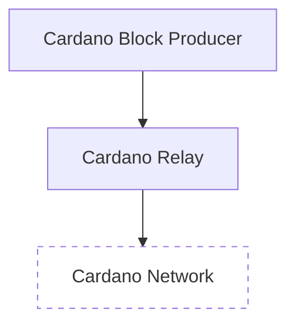
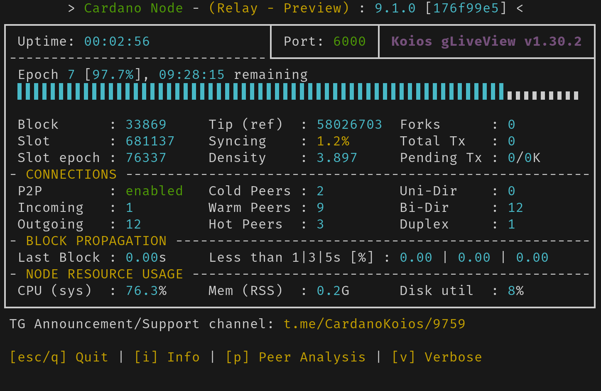

# SPO Workshop

## Setting Up a Cardano SPO on Preview Testnet

This guide provides a detailed walkthrough for setting up a Cardano Stake Pool Operator (SPO) on the Preview testnet. It's designed for educational purposes and should not be used for production or mainnet environments.

This tutorial utilizes Multipass which is an ideal tool for localization of Ubuntu instances and best suited for testing and development.

## Cardano Node System Requirements

Before starting, ensure your local workstation or server meets these minimum requirements:

| **Requirement**                  | **Mainnet** | **Testnets** |
|-----------------------------------|-------------|--------------|
| **Operating System**             | Linux (Ubuntu recommended) | Linux (Ubuntu recommended) |
| **CPU**                          | Minimum 2 cores, Quad-core or better recommended | Minimum 2 cores, Quad-core or better recommended |
| **RAM**                          | 8 GB or more recommended | 4 GB or more recommended |
| **Storage**                      | SSD recommended, 150 GB of free storage (250 GB recommended for future growth) | SSD recommended, at least 20 GB free space |

This tutorial assumes you are using a Linux or Windows system with an AMD or Intel CPU. ARM-based systems like newer Macs are not supported due to lack of pre-built binaries.

## Minimum viable SPO architecture


A Cardano SPO requires a minimum of 2 Cardano nodes:

1. **Cardano Relay Node:** A Cardano Relay Node propagates transactions and blocks across the network, enhancing connectivity and reliability for stake pools.

2. **Cardano Block Producer Node (BP node):** A Cardano Block Producer Node, often part of a stake pool, creates new blocks and mints new transactions, crucial for maintaining the blockchain's integrity and operation.



More relay nodes are recommended for stake pool operation to increase network resilience, ensure better block propagation, and minimize the risk of downtime or connectivity issues that could affect block production. Thereofore, multiple relay nodes are strongly recommended for production and mainnet environments. However, this tutorial is targeting the Preview testnet and will use 1 BP node and 1 relay node.

## Step 1: Create Ubuntu instances using Multipass

Multipass is used to manage Ubuntu virtual machines (VMs) easily.

1. **Download and Install Multipass:**
   - Visit the official [Multipass](https://multipass.run/install) website and download the appropriate version for your operating system.
   - Follow the installation instructions provided.

2. **Verify Multipass Installation:**

    - Open shell and invoke multipass to check version and display usage and commands:
     
   ```shell
   multipass --version
   multipass --help
   ```

3. **Launch 2 Ubuntu instances using Multipass**

    -  Launch 2 Ubuntu instances following recommended system requirements.

   ```shell
    # Launching the first instance named cn1
    multipass launch \
        -n cn1 \                  # Name of the instance: cn1
        -c 2 \                    # Number of CPU cores: 2
        -m 4GB \                  # Memory allocation: 4GB
        -d 20GB                   # Disk space allocation: 20GB

    # Launching the second instance named cn2
    multipass launch \
        -n cn2 \                  # Name of the instance: cn2
        -c 2 \                    # Number of CPU cores: 2
        -m 4GB \                  # Memory allocation: 4GB
        -d 20GB                   # Disk space allocation: 20GB
   ```

   This creates two Ubuntu instances named `cn1` and `cn2`. In other words, "cardano-node-1" and "cardano-node-2".

4. **List Ubuntu instances and obtain IP addresses:**

  - List the Ubuntu instances that were created:

    ```shell
    multipass list
    ```
    Example output: 

    ```shell
    $ multipass list
    Name                    State             IPv4             Image
    cn1                     Running           10.249.38.7      Ubuntu 24.04 LTS
    cn2                     Running           10.249.38.198    Ubuntu 24.04 LTS
    ```

    This command helps verify VM creation, status, and IP addresses, crucial for node configuration.

  - Make a note of each IP address. This will be needed.

    Feel free to utilize the Multipass GUI that comes with Multipass. Simply go in your applications and select Multipass to launch the GUI.

    


## Step 2: Install SPO Toolkit

The [SPO Guild Operator](https://cardano-community.github.io/guild-operators/) toolkit simplifies Cardano node setup and common SPO tasks.

1. **Run setup and deployment script on multiple instances:**

    Open a new shell and invoke this setup script:
   ```shell
    #!/bin/bash

    # Array of instance names
    instances=("cn1" "cn2")

    # Loop through each instance
    for instance in "${instances[@]}"; do
        echo "🚀 Running commands on $instance..."

        # Execute commands inside the instance
        multipass exec "$instance" -- bash -c '
          # Update and upgrade system packages
          sudo apt update -y && sudo apt upgrade -y

          # Create or change to tmp directory
          mkdir -p "$HOME/tmp" && cd "$HOME/tmp"

          # Install curl
          sudo apt -y install curl

          # Download and set permissions for guild-deploy script
          curl -sS -o guild-deploy.sh https://raw.githubusercontent.com/cardano-community/guild-operators/master/scripts/cnode-helper-scripts/guild-deploy.sh
          chmod 755 guild-deploy.sh

          # Run guild-deploy script with specific parameters
          ./guild-deploy.sh -b master -n preview -t cnode -s pdlcowx

          # Source bashrc for environment variables
          . "${HOME}/.bashrc"

          # Clone or update cardano-node repository
          cd ~/git || mkdir -p ~/git && cd ~/git
          git clone https://github.com/intersectmbo/cardano-node || (cd cardano-node && git fetch --tags --recurse-submodules --all && git pull)

          # Change to cardano-node directory
          cd cardano-node

          # Checkout the latest release tag
          git checkout $(curl -sLf https://api.github.com/repos/intersectmbo/cardano-node/releases/latest | jq -r .tag_name)

          # Build all components
          $CNODE_HOME/scripts/cabal-build-all.sh
        '

        echo "🎉 Finished running commands on $instance."
    done
    ```
     This script may take a few minutes ⌛ to complete as it provisions both instances.

## Strategic Node Configuration: From Relay to Block Producer

:::important

`cn1` will be designated as the Relay node. `cn2` will initially be set up as a Relay node but will later be converted into a BP node. This setup involves configuring both `cn1` and `cn2` initially as Relay nodes, followed by a transition where `cn2` assumes the role of a BP node.

:::

Starting `cn2` as a Relay node simplifies network integration and peer connection, streamlining the transition to a BP node.

## Step 3: Configure `cn1` instance:

1. **Enter `cn1` Instance:**
    - Using Multipass enter the `cn1` instance:
    ```shell
    multipass shell cn1
    ```

2. **Test start the relay node interactively in shell:**

    Keep the default port (`6000`) and paths setup by the toolkit. This is described in `$CNODE_HOME/scripts/env` and many env variables may be customized.

    - Test start the relay node interactively in the shell:

    ```shell
    cd "${CNODE_HOME}"/scripts
    ./cnode.sh
    ```

    You should see some output that ends with `Listening on http://127.0.0.1:12798`. This is the correct output. `CRTL` + `C` will close the node, but let's not close it just yet.

3. **Monitor the node with the `gLiveView` utility:** 

    - Continue to run the node interactively in shell.
    - Open a new shell and enter `cn1` again:
    ```shell
    multipass shell cn1
    ```
    - Monitor the node using `gLiveView`:
    ```shell
    cd $CNODE_HOME/scripts
    ./gLiveView.sh
    ```

    This should result in realtime information about the node. For example:

    

    - Exit gLiveView with `CTL` + `C`.
    - Stop the node with `CTL` + `C`.

4. **Modify `cn1` config file:**

    - Open `$CNODE_HOME/files/config.json` in an editor.
    - Edit `"PeerSharing"` to be `true` instead of `false`.

5. **Modify topology file:**

    The relay node needs to have a persistant connection to the intended BP node (`cn2`). This is described in the `$CNODE_HOME/files/topology.json` file.

    The defaults contents of `$CNODE_HOME/files/topology.json` look like so:

    <details><summary>topology.json (before)</summary>

    ```json
    {
      "bootstrapPeers": [
        {
          "address": "preview-node.play.dev.cardano.org",
          "port": 3001
        }
      ],
      "localRoots": [
        {
          "accessPoints": [
            {
              "address": "127.0.0.1",
              "port": 6000,
              "description": "replace-this-with-BP"
            },
            {
              "address": "127.0.0.1",
              "port": 6001,
              "description": "replace-this-with-relay"
            }
          ],
          "advertise": false,
          "trustable": true,
          "hotValency": 2
        },
        {
          "accessPoints": [
            {
              "address": "preview-test.ahlnet.nu",
              "port": 2102,
              "pool": "AHL"
            },
            {
              "address": "95.216.173.194",
              "port": 16000,
              "pool": "HOM1"
            },
            {
              "address": "tn-preview.psilobyte.io",
              "port": 4201,
              "pool": "PSBT"
            },
            {
              "address": "tn-preview2.psilobyte.io",
              "port": 4202,
              "pool": "PSBT"
            }
          ],
          "advertise": false,
          "trustable": false,
          "hotValency": 2,
          "warmValency": 3
        }
      ],
      "publicRoots": [
        {
          "accessPoints": [],
          "advertise": false
        }
      ],
      "useLedgerAfterSlot": 53827185
    }
    ```

    </details>

    - Edit `$CNODE_HOME/files/topology.json` in your prefered editor.
    - Add the IP `address` for the BP node (`cn2`) in `"localRoots"`.
    - Unless you have multiple relay nodes, simply remove the relay node placeholder from `"localRoots"`.
    - Set "`hotValency"` to `1` since `cn2` is the only other `"accessPoints"`.

    <details><summary>topology.json (after)</summary>

    ```json
    {
      "bootstrapPeers": [
        {
          "address": "preview-node.play.dev.cardano.org",
          "port": 3001
        }
      ],
      "localRoots": [
        {
          "accessPoints": [
            {
              "address": "10.249.38.198",
              "port": 6000,
              "description": "cn2"
            }
          ],
          "advertise": false,
          "trustable": true,
          "hotValency": 1
        },
        {
          "accessPoints": [
            {
              "address": "preview-test.ahlnet.nu",
              "port": 2102,
              "pool": "AHL"
            },
            {
              "address": "95.216.173.194",
              "port": 16000,
              "pool": "HOM1"
            },
            {
              "address": "tn-preview.psilobyte.io",
              "port": 4201,
              "pool": "PSBT"
            },
            {
              "address": "tn-preview2.psilobyte.io",
              "port": 4202,
              "pool": "PSBT"
            }
          ],
          "advertise": false,
          "trustable": false,
          "hotValency": 2,
          "warmValency": 3
        }
      ],
      "publicRoots": [
        {
          "accessPoints": [],
          "advertise": false
        }
      ],
      "useLedgerAfterSlot": 53827185
    }
    ```
    </details>

6. **Setup node to run as service:**

    Instead of manually starting the node, configure it as a systemd service for automatic startup. The toolkit includes a script to make this easier:

    - Invoke the systemd setup scripts:

    ```shell
    cd $CNODE_HOME/scripts
    ./cnode.sh -d
    # Deploying cnode.service as systemd service
    # cnode.service deployed successfully

    ./submitapi.sh -d
    # Deploying cnode-submit-api.service as systemd service
    # cnode-submit-api deployed successfully
    ```

7. **Start node as a service:**

    - Start the systemd service files created:

    ```shell
    sudo systemctl start cnode.service
    sudo systemctl start cnode-submit-api.service
    ```
    
    Check `status` and replace status with `stop`/`start`/`restart` depending on what action to take.

    ```shell
    sudo systemctl status cnode.service
    sudo systemctl status cnode-submit-api.service
    ```

    - In a new shell, monitor node to verify node status using `gLiveView`:

    ```shell
    cd $CNODE_HOME/scripts
    ./gLiveView.sh
    ```

## Step 4: Configure `cn2` instance.

As mentioned earlier, `cn2` will initially run as a Relay node, then be converted into a BP node.

1. **Enter `cn2` Instance:**
    - Using Multipass enter the `cn2` instance:
    ```shell
    multipass shell cn2
    ```

2. **Setup node to run as service:**

    Instead of manually starting the node, configure it as a systemd service for automatic startup. The toolkit includes a script to make this easier:

    - Invoke the systemd setup scripts:

    ```shell
    cd $CNODE_HOME/scripts
    ./cnode.sh -d
    # Deploying cnode.service as systemd service
    # cnode.service deployed successfully

    ./submitapi.sh -d
    # Deploying cnode-submit-api.service as systemd service
    # cnode-submit-api deployed successfully
    ```

3. **Start node as a service:**

    - Start the systemd service files created:

    ```shell
    sudo systemctl start cnode.service
    sudo systemctl start cnode-submit-api.service
    ```
    
    Check `status` and replace status with `stop`/`start`/`restart` depending on what action to take.

    ```shell
    sudo systemctl status cnode.service
    sudo systemctl status cnode-submit-api.service
    ```

    - In a new shell, monitor node to verify node status using `gLiveView`:

    ```shell
    cd $CNODE_HOME/scripts
    ./gLiveView.sh
    ```

## Allow both `cn1` and `cn2` to sync to 100%.

Allow both `cn1` and `cn2` to sync to 100%. This can be tracked with the `gLiveView` utility and can take up to a couple hours.

:::tip

Cardano node performs faster if you allocate more than the minimum required system resources (Ex: More CPU, more Memory, faster SSD, etc...)

:::

## Step 5: Convert `cn2` into a BP node


<!-- 2. **Modify block producer node config file:**

    - Open `$CNODE_HOME/files/config.json` in an editor.
    - Edit `"PeerSharing"` and `"EnableP2P"` to be `false`.

3. **Modify block producer node topology file:**

```json
{
  "bootstrapPeers": [],
  "localRoots": [
    {
      "accessPoints": [
        {
          "address": "10.190.51.250",
          "port": 6000,
          "description": "cn2"
        }
      ],
      "advertise": false,
      "trustable": true,
      "hotValency": 1
    }
  ],
  "publicRoots": [
    {
      "accessPoints": [],
      "advertise": false
    }
  ],
  "useLedgerAfterSlot": -1
} -->